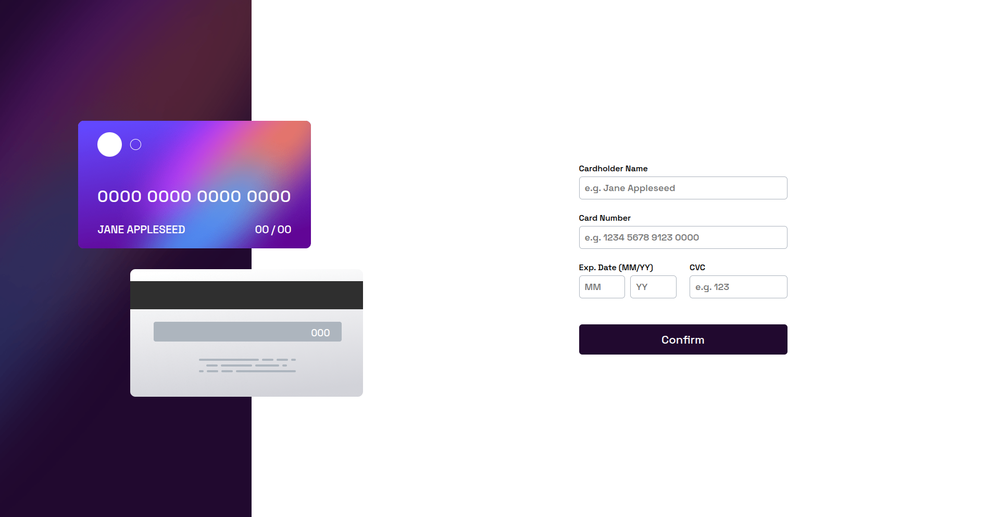

📄 Read in [English](./README.md)

# Frontend Mentor - QR code component

**Esse repositório é destinado às minhas soluções dos desafios da plataforma FrontEnd Mentor**

## Olá, Seja Bem Vindo! 👋

**Obrigado por conferir essa solução para esse desafio!** 
 
Vamos conferir de forma geral esse projeto.

## Sobre o Desafio 🎯

O desafio é construir esta página e deixá-la o mais parecida possível com o design.

Funcionalidades esperadas:

- Preencha o formulário e veja os detalhes do cartão serem atualizados em tempo real
- Receba mensagens de erro ao enviar o formulário se:
  - Algum dos campos estiver vazio
  - O número do cartão, a data de vencimento ou o CVC estiverem no formato errado
- Veja o layout otimizado de acordo com o tamanho da tela do seu dispositivo
- Veja os estilos de hover, active e focus nos elementos interativos da página

## Layout 🎨

É possível visualizar todos os layouts (mobile e desktop) na pasta da aplicação ` ./design ` .

## Tecnologias e Conceitos Utilizados 💻

- HTML
- CSS
- JavaScript

## Evolução Contínua 🚀

Foi algo muito satisfatório o desenvolvimento desse site, principalmente a parte em JavaScript. Aprendi muito resolvendo os problemas relacionados ao tratamento de erros em um formulário. Esse é o meu primeiro formulário onde existe essa interação de atualizar os dados do cartão conforme o input do usuário. Foi desafiador, mas contribuiu bastante para o meu aprendizado!

## Deploy 🔥

A aplicação está hospedada via GitHub Pages.
 
<a href="https://luiz-feliph.github.io/Frontend-Mentor-Challenges/Interactive%20Card%20Details%20Form">Clique Aqui </a> para visualizar a aplicação.
