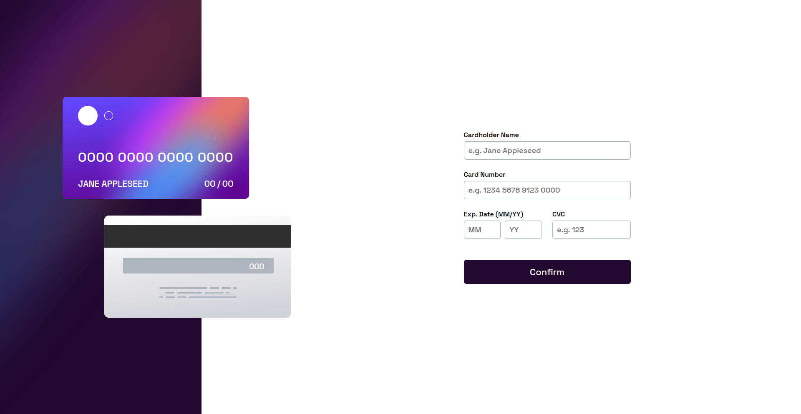

📄 Leia em [Português](./README-pt.md)

# Frontend Mentor - QR Code Component

**This repository is intended for my solutions to Frontend Mentor platform challenges.**

## Hello, Welcome! 👋

**Thank you for checking out this solution for this challenge!**  
Let's go over this project in a general way.

## About the Challenge 🎯

The challenge is to build this page and make it as close as possible to the design.

Expected functionality:

- Fill in the form and see the card details update in real time
- Receive error messages when submitting the form if:
  - Any of the fields are empty
  - The card number, expiration date, or CVC are in the wrong format
- View the optimized layout depending on your device’s screen size
- See hover, active, and focus states for interactive elements on the page

## Layout 🎨

All layouts (mobile and desktop) can be viewed in the `./design` folder of the application.

## Technologien and Concepts Used 💻

- HTML
- CSS
- JavaScript

## Continuous Improvement 🚀

It was a very rewarding experience developing this website, especially the JavaScript side. I learned a lot by solving problems related to form error handling. This is my first form where there’s an interaction to update card details in real time based on the user's input. It was challenging, but it contributed a great deal to my learning process.

## Deployment 🔥

The application is hosted via GitHub Pages.  
 
<a href="https://luiz-feliph.github.io/Frontend-Mentor-Challenges/Interactive%20Card%20Details%20Form">Click Here</a> to view the application.

