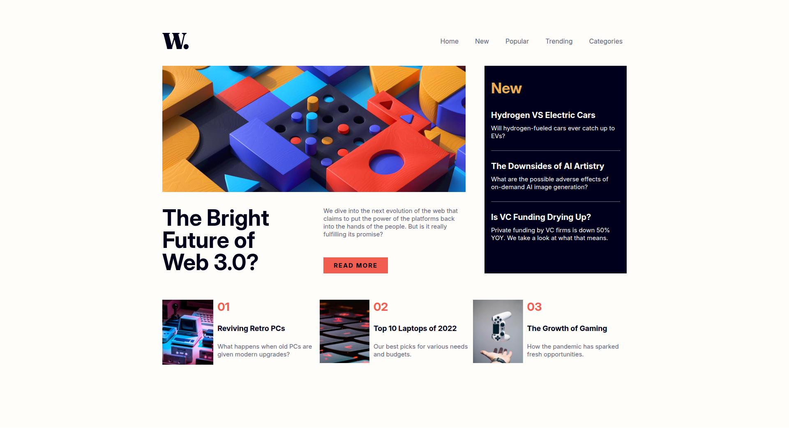

📄 Leia em [Português](./README-pt.md)

# Frontend Mentor - QR Code Component

**This repository contains my solutions to challenges from the FrontEnd Mentor platform**

## Hello, Welcome! 👋

**Thank you for checking out this solution to the challenge!**  
 
Let's take a general look at this project.

## About the Challenge 🎯

The challenge is to build this page and make it look as close as possible to the design.

Expected features:

- Fully responsive layout, adapting properly to different screen sizes (mobile and desktop).
- Implementation of an adaptive navbar that transforms into a hamburger menu on smaller screens.
- Effective use of **flexbox** and **grid layout** properties for element structuring.

## Layout 🎨

You can view all the layouts (mobile and desktop) in the application folder ` ./design `.

## Technologies and Concepts Used 💻

- HTML
- CSS
- JavaScript

## Continuous Improvement 🚀

During development, structuring the desktop layout was straightforward and direct. However, the mobile design required more attention, especially to ensure the components adapted correctly to the proposed layout.

The biggest challenge was implementing the hamburger menu, which required fine adjustments and the addition of animations to ensure smooth transitions when opening and closing, providing a more pleasant and fluid user experience.

## Deploy 🔥

The application is hosted via GitHub Pages.  
 
<a href="https://luiz-feliph.github.io/Frontend-Mentor-Challenges/News%20Homepage">Click Here</a> to view the application.
