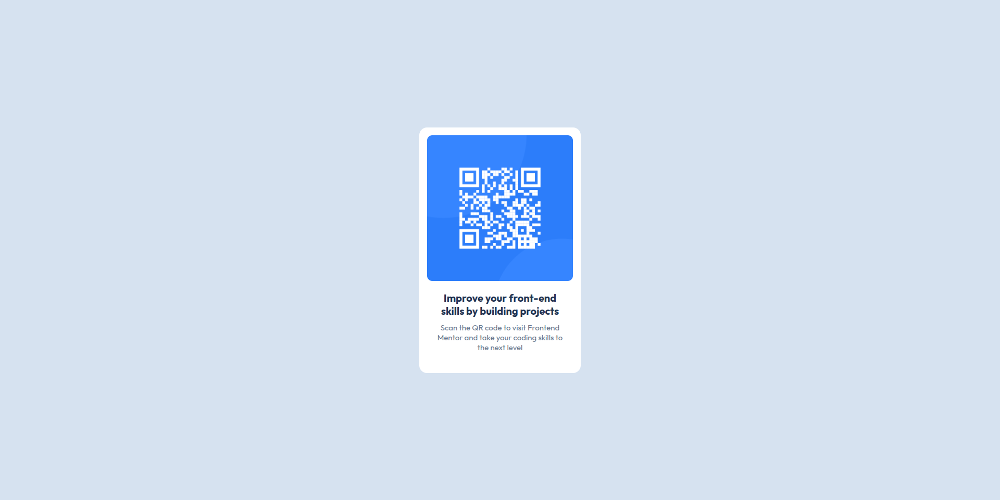

📄 Read in [English](./README.md)

# Frontend Mentor - QR code component

**Esse repositório é destinado às minhas soluções dos desafios da plataforma FrontEnd Mentor**

## Olá, Seja Bem Vindo! 👋

**Obrigado por conferir essa solução para esse desafio!** 
 
Vamos conferir de forma geral esse projeto.

## Sobre o Desafio 🎯

O desafio é construir esta página e deixá-la o mais parecida possível com o design.

Funcionalidades esperadas:

- Layout responsivo, adaptando-se a diferentes tamanhos de tela (mobile e desktop).

## Layout 🎨

É possível visualizar todos os layouts (mobile e desktop) na pasta da aplicação ` ./design ` .

## Tecnologias e Conceitos Utilizados 💻

- HTML
- CSS

## Evolução Contínua 🚀

Esse foi meu primeiro desafio do FrontEnd Mentor. Fiquei feliz em conseguir aplicar os conhecimentos que estou estudando diariamente.

Resolvi esse desafio tranquilamente, sem grandes dificuldades. Por ser o primeiro desafio, acabou sendo de nível inicial, apenas para introduzir as funcionalidades da plataforma.

## Deploy 🔥

A aplicação está hospedada via GitHub Pages.
 
<a href="https://luiz-feliph.github.io/Frontend-Mentor-Challenges/QR%20Code%20Component">Clique Aqui </a> para visualizar a aplicação.
