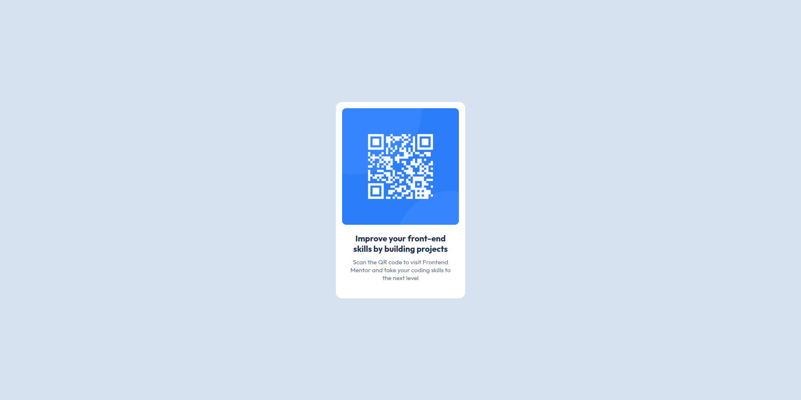

📄 Leia em [Português](./README-pt.md)

# Frontend Mentor - QR code component

**This repository is intended for my solutions to challenges from the Frontend Mentor platform**

## Hello, Welcome! 👋

**Thanks for checking out this solution to this challenge!**  
Let's take a general look at this project.

## About the Challenge 🎯

The challenge is to build this page and make it as close as possible to the design.

Expected features:

- Responsive layout, adapting to different screen sizes (mobile and desktop).

## Layout 🎨

You can view all layouts (mobile and desktop) in the application folder `./design`.

## Technologies and Concepts Used 💻

 
  
  

## Continuous Improvement 🚀

This was my first challenge from Frontend Mentor. I was happy to be able to apply the knowledge I’ve been studying daily.

I completed this challenge calmly, without major difficulties. As it was the first challenge, it ended up being an introductory-level one, just to get familiar with the platform's features.

## Deploy 🔥

The application is hosted via GitHub Pages.  
<a href="https://luiz-feliph.github.io/Frontend-Mentor-Challenges/QR%20Code%20Component">Click Here</a> to view the application.
